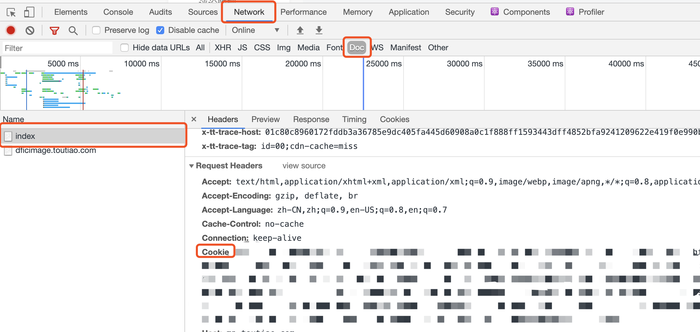
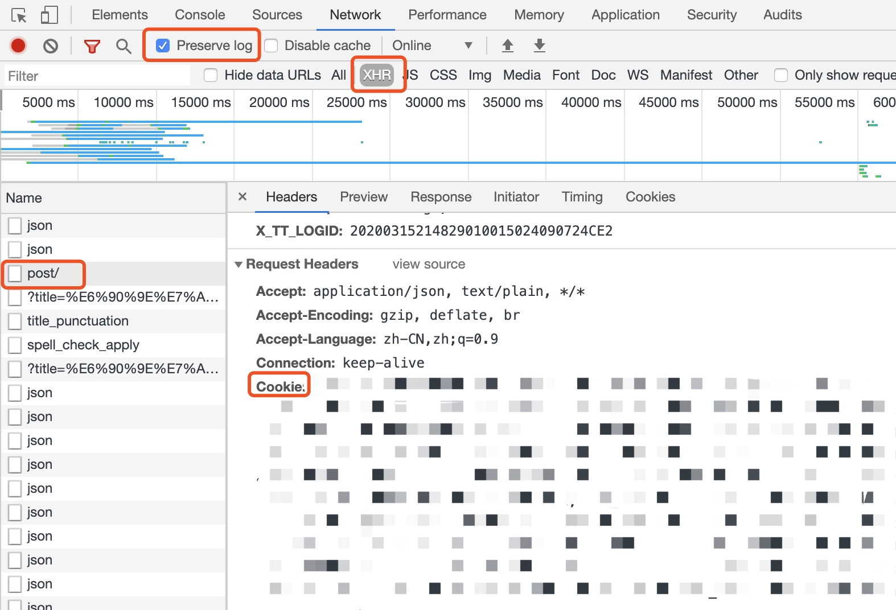

## toutiao 

toutiao 是一个自动获取搞笑动图并发布头条文章的项目

[]()

## 使用

1. 创建 Python3 虚拟环境

    ```bash
    virtualenv -p /usr/local/bin/python3 venv
    ```
   
2. 激活虚拟环境
    
   ```bash
   source venv/bin/activate
   ```

3. 安装依赖

   ```bash
   pip install -r requirements.txt
   ```

4. 修改配置

   ```python
   # config.py
   Toutiao_cookie_str = "xxx"
   ```
 
5. 修改 utils/toutiao.py

    为了避免内容违规，建议将 utils/toutiao.py 中的自动发送注释，避免被平台扣分
    
    ```python
    # 选择无图
    # self.click_by_xpath('//*[@id="graphic"]/div/div[2]/div/div[2]/div[1]/div/div[2]/div/div/label[3]/div')
    # time.sleep(10)
    # # 发表
    # self.click_by_xpath('//*[@id="publish"]')
    ```


   
 ## 如何获取cookie
 
 1. 打开浏览器控制台（windows 按 F12 / Mac 按 ⌘+⌥+i），切换到 network 选项卡，手动登录 mp.toutiao.com，将下图中的 cookie 值完整的复制到 config.py 中
 
    
 
 2. 运行程序，发布文章如果需要验证手机，请看这一步（不需要验证手机则忽略）
 
    程序将会自动开启一个浏览器，并将内容自动填入编辑器内，点击发布按钮，提示需要验证手机，
    打开浏览器控制台, 切换到 network 选项卡， 勾选 Preserve log 选项，切换到 XHR 选项卡，
    验证完手机后点击发布。使用下图中的 cookie 替换 config 中的 cookie。
    
    
    
## 注意事项

1. 每日只能发布 4 篇文章左右，请勿做太多尝试

2. 文章内容需要人工审查，避免内容违规，导致账号被封

3. 该项目仅作为学习使用，请勿用于商业用途
